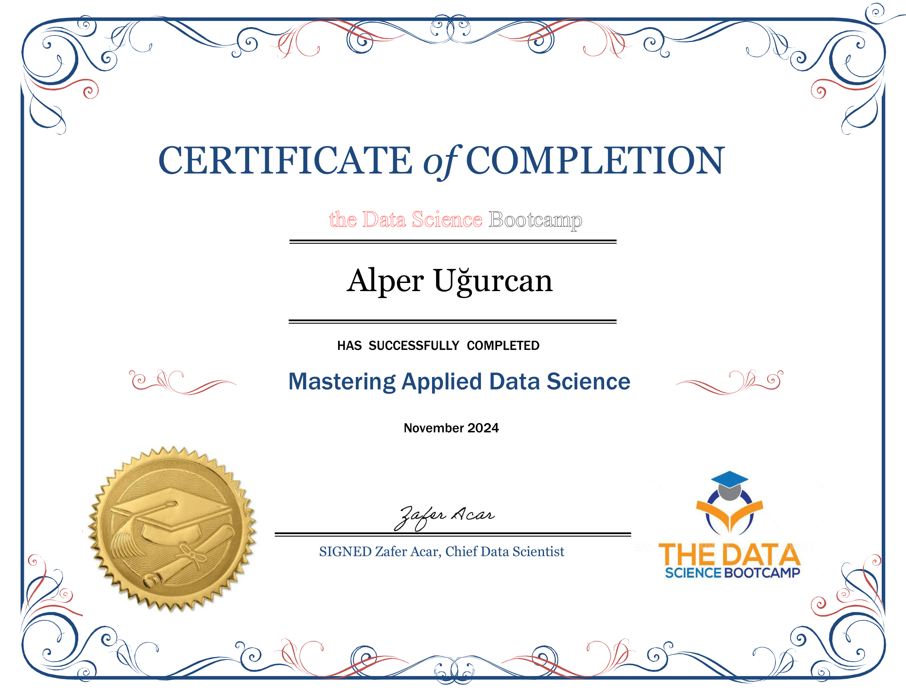

# The Data Science Bootcamp Certificate

- **500+ hours**
- **80+ Projects**

## 🎯 About the Bootcamp

- **Python Programming** (e.g., NumPy, Pandas)  
- **Data Visualization** (e.g., Matplotlib, Seaborn, Plotly)  
- **Machine Learning** (Supervised and Unsupervised Learning)  
- **Deep Learning** (Neural Networks, CNNs, RNNs, Transformers)
- **Natural Language Processing (NLP)** (e.g., text generation, sentiment analysis)
- **Computer Vision** (e.g., image classification, object detection)
- **MLOps** (e.g., CI/CD pipelines, model deployment)

## 📚 Other Trainings

#BlockChain - #CSS - #Flask - #GIS - #HTML - #JavaScript - #LargeLanguageModels - #MobileAppDevelopment - #QuantumComputing - #RecommenderSystems - #Spark - #SQL - #TimeSeriesAnalysis

## 📜 Certificate

